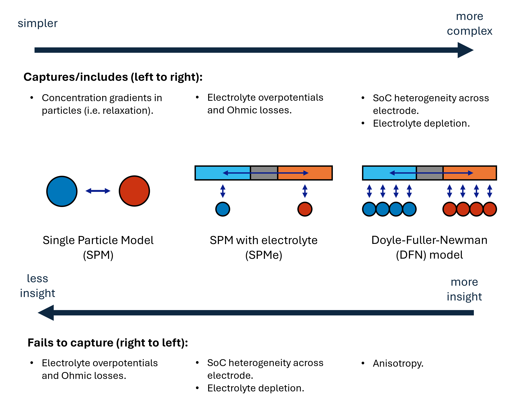

# Battery Models

References for the battery models used in PyBaMM simulations can be found calling
```python
pybamm.print_citations()
```
However, each model can be defined in slightly different ways depending on the paper. For this reason, in this page we state some of the standard battery models with the exact definition used in PyBaMM. The goal is not to provide a thorough explanation of the models, but just to state them. For more details, we strongly advise the reader to follow the references provided in this page.

## Lithium-ion battery models

The standard models for lithium-ion batteries can be classified in a hierarchical structure, from simple to complex. Here, as shown in the figure, we focus on the SPM, SPMe and DFN models. This hierarchy is discussed in a lot more detail in the review article by [Brosa Planella et al. (2022)](https://doi.org/10.1088/2516-1083/ac7d31), and also explains in detail how these models are derived.



These models impose conservation of lithium and charge, so the variables we are interested in are the lithium concentration in the solid and electrolyte phases, $c_k$ and $c_\mathrm{e}$ respectively, and the electric potential $\phi_k$ and $\phi_\mathrm{e}$ in the solid and electrolyte phases, respectively. The subscript $k \in \{\mathrm{n}, \mathrm{p}\}$ denotes the negative and positive electrodes, respectively.

**Important remark:** these models account for the electrochemistry of the battery, and thus not include the thermal and degradation effects. These effects can be added to the electrochemical models as additional equations (and through the PyBaMM model options).

The parameters involved in these models are defined in the following table (where parameters with $k \in \{\mathrm{n}, \mathrm{s}, \mathrm{p}\}$ may have different values for each electrode and separator):

| Symbol | Description | Units |
|:------:|:-----------:|:-----:|
| $R_k$ | Particle radius | m |
| $L_k$ | Electrode/separator thickness | m |
| $D_k (c_k)$ | Electrode particle diffusivity | m $^2$ s $^{-1}$ |
| $\sigma_k$ | Electrode conductivity | S m $^{-1}$ |
| $U_k (c_k)$ | Open-circuit potential | V |
| $j_{0 k} (c_k, c_\mathrm{e})$ | Exchange current density | A m $^{-2}$ |
| $\varepsilon_{\mathrm{s}, k}$ | Solid phase volume fraction | - |
| $\varepsilon$ | Porosity | - |
| $\mathcal{B}$ | Transport efficiency | - |
| $D_\mathrm{e}(c_\mathrm{e})$ | Electrolyte diffusivity | m $^2$ s $^{-1}$ |
| $\sigma_\mathrm{e}(c_\mathrm{e})$ | Electrolyte conductivity | S m $^{-1}$ |
| $t^+(c_\mathrm{e})$ | Transference number | - |
| $f_\mathrm{therm}(c_\mathrm{e})$ | Thermodynamic factor | - |
| $c_\mathrm{e0}$ | Initial electrolyte concentration | mol m $^{-3}$ |
| $T$ | Temperature | K |
| $i_\mathrm{app}$ | Applied current density | A m $^{-2}$ |

The surface area per unite volume $a_k$ is defined as $a_k = 3 \varepsilon_{\mathrm{s}, k}/ R_k$. The two physical constants appearing in the models are the Faraday constant is $F$, the gas constant $R$.

Note that not all models use all of these parameters. For example, the SPM only uses a subset.

### Single particle model (SPM)
The SPM is the simplest of the three models considered here. It assumes that the active material particles behave similarly so they can be described by an averaged particle. The model considers two particles: one for the positive electrode and one for the negative electrode, where we model the lithium concentration as a function of space and time, denoted as $c_\mathrm{p}$ and $c_\mathrm{n}$ respectively. The model assumes spherical symmetry and the domains are $0 \leq r \leq R_k$. Two (independent) diffusion equations need to be solved for the two particles, and any additional quantities (such as the cell voltage) are computed from explicit expressions.


In PyBaMM, the Single Particle Model is defined as follows:
$$\begin{align}
\frac{\partial c_\mathrm{n}}{\partial t} &= \frac{1}{r^2} \frac{\partial}{\partial r} \left (r^2 D_\mathrm{n} (c_\mathrm{n}) \frac{\partial c_\mathrm{n}}{\partial r} \right), & \text{ in } \quad 0 < r < R_\mathrm{n},\\
\frac{\partial c_\mathrm{p}}{\partial t} &= \frac{1}{r^2} \frac{\partial}{\partial r} \left (r^2 D_\mathrm{p} (c_\mathrm{p}) \frac{\partial c_\mathrm{p}}{\partial r} \right), & \text{ in } \quad 0 < r < R_\mathrm{p},
\end{align}$$

with boundary conditions
$$\begin{align}
\frac{\partial c_\mathrm{n}}{\partial r} &= 0, & \text{ at } \quad r = 0,\\
-D_\mathrm{p} (c_\mathrm{n}) \frac{\partial c_\mathrm{n}}{\partial r} &= \frac{i_\mathrm{app}(t)}{a_\mathrm{n} L_\mathrm{n} F}, & \text{ at } \quad r = R_\mathrm{n},\\
\frac{\partial c_\mathrm{p}}{\partial r} &= 0, & \text{ at } \quad r = 0,\\
-D_\mathrm{p} (c_\mathrm{p}) \frac{\partial c_\mathrm{p}}{\partial r} &= -\frac{i_\mathrm{app}(t)}{a_\mathrm{p} L_\mathrm{p} F}, & \text{ at } \quad r = R_\mathrm{p},
\end{align}$$

and initial conditions
$$\begin{align}
c_\mathrm{n}(r, 0) &= c_\mathrm{n0}(r), & \text{ at } \quad t = 0,\\
c_\mathrm{p}(r, 0) &= c_\mathrm{p0}(r), & \text{ at } \quad t = 0.
\end{align}
$$

The voltage can then be computed from $c_\mathrm{n}$ and $c_\mathrm{p}$ as
$$\begin{align}
V(t) &= U_\mathrm{p}(c_\mathrm{p}(R_\mathrm{p}, t)) - U_\mathrm{n}(c_\mathrm{n}(R_\mathrm{n}, t)) \\
& \quad - \frac{2 R T}{F} \mathrm{arcsinh} \left(\frac{i_\mathrm{app}(t)}{a_\mathrm{n} L_\mathrm{n} j_{0\mathrm{n}}} \right) - \frac{2 R T}{F} \mathrm{arcsinh} \left(\frac{i_\mathrm{app}(t)}{a_\mathrm{p} L_\mathrm{p} j_{0\mathrm{p}}} \right),\nonumber
\end{align}$$

where $j_{0\mathrm{n}}(c_\mathrm{n})$ and $j_{0\mathrm{p}}(c_\mathrm{p})$ are the interfacial current densities at the negative and positive electrodes, respectively, and can be defined in the parameter set by the user.

### Single particle model with electrolyte (SPMe)
The SPMe enhances the SPM by including an electrolyte phase. This model is more complex than the SPM, but still relatively simple. In addition to the two particles, the model considers the electrolyte concentration $c_\mathrm{e}$ over the electrodes (and separator) thickness $0 \leq x \leq L$ (where $L = L_\mathrm{n} + L_\mathrm{s} + L_\mathrm{p}$).

The equation for the electrolyte concentration is given by
$$\begin{equation}
\varepsilon\frac{\partial c_\mathrm{e}}{\partial t} = \frac{\partial}{\partial x} \left(D_\mathrm{e}(c_\mathrm{e}) \mathcal{B}(x) \frac{\partial c_\mathrm{e}}{\partial x} + \frac{1 - t^+(c_\mathrm{e})}{F} i_\mathrm{e}\right),
\end{equation}$$
with boundary conditions
$$\begin{align}
\frac{\partial c_\mathrm{e}}{\partial x} &= 0, & \text{ at } \quad x = 0 \quad \text{and} \quad x = L,\\
\end{align}$$
and initial condition
$$\begin{align}
c_\mathrm{e}(x, 0) &= c_\mathrm{e0}, & \text{ at } \quad t = 0.
\end{align}$$

The current in the electrolyte can be explicitly computed as
$$\begin{equation}
i_\mathrm{e}(x, t) = \begin{cases}
\frac{i_\mathrm{app}(t)}{L_\mathrm{n}} x, & \text{ in } \quad 0 \leq x < L_\mathrm{n},\\
i_\mathrm{app}(t), & \text{ in } \quad L_\mathrm{n} \leq x < L - L_\mathrm{p},\\
\frac{i_\mathrm{app}(t)}{L_\mathrm{p}} (L - x), & \text{ in } \quad L - L_\mathrm{p} \leq x \leq L.
\end{cases}
\end{equation}$$

From the electrolyte concentration, we can compute additional corrections to the SPM voltage expression. Then, the voltage can be computed as
$$\begin{align}
V(t) &= U_\mathrm{eq} + \eta_\mathrm{r} + \eta_\mathrm{e} + \Delta \phi_\mathrm{e} - \Delta \phi_\mathrm{s},
\end{align}$$
where each component is defined as
$$\begin{align}
U_\mathrm{eq} &= U_\mathrm{p}(c_\mathrm{p}(R_\mathrm{p}, t)) - U_\mathrm{n}(c_\mathrm{n}(R_\mathrm{n}, t)),\\
\eta_\mathrm{r} &= -\frac{2 R T}{F} \left( \frac{1}{L_\mathrm{p}}\int_{L - L_\mathrm{p}}^L\mathrm{arcsinh} \left(\frac{i_\mathrm{app}(t)}{a_\mathrm{p} L_\mathrm{p} j_{0\mathrm{p}}} \right) \mathrm{d} x + \frac{1}{L_\mathrm{n}} \int_0^{L_\mathrm{n}}\mathrm{arcsinh} \left(\frac{i_\mathrm{app}(t)}{a_\mathrm{n} L_\mathrm{n} j_{0\mathrm{n}}} \right) \mathrm{d} x \right),\\
\eta_\mathrm{e} &= \frac{2 R T}{F} \left( \frac{1}{L_\mathrm{p}}\int_{L - L_\mathrm{p}}^L \int_0^x (1 - t^+)f_\mathrm{therm} \frac{\partial \log c_\mathrm{e}(s, t)}{\partial s} \mathrm{d} s \mathrm{d} x + \frac{1}{L_\mathrm{n}} \int_0^{L_\mathrm{n}}\int_0^x (1 - t^+)f_\mathrm{therm} \frac{\partial \log c_\mathrm{e}(s, t)}{\partial s} \mathrm{d} s \mathrm{d} x \right),\\
\Delta \phi_\mathrm{e} &= - \frac{1}{L_\mathrm{p}} \int_{L - L_\mathrm{p}}^L \int_0^x\frac{i_\mathrm{app}(t)}{\sigma_\mathrm{e}(c_\mathrm{e}(s, t)) \mathcal{B}(s)} \mathrm{d} s \mathrm{d} x + \frac{1}{L_\mathrm{n}} \int_0^{L_\mathrm{n}} \int_0^x\frac{i_\mathrm{app}(t)}{\sigma_\mathrm{e}(c_\mathrm{e}(s, t)) \mathcal{B}(s)} \mathrm{d} s \mathrm{d} x,\\
\Delta \phi_\mathrm{s} &= -\frac{i_\mathrm{app}(t)}{3} \left( \frac{L_\mathrm{p}}{\sigma_\mathrm{p}} + \frac{L_\mathrm{n}}{\sigma_\mathrm{n}} \right),
\end{align}$$
where now $j_{0k}(c_k, c_\mathrm{e})$ depends both on the particle surface concentration and the electrolyte concentration.

### Doyle-Fuller-Newman model (DFN)
Finally, we present the DFN model, which is the most complex of the models considered here. The model still considers the multiscale domain of the particles $0 \leq r \leq R_k$ and the electrolyte $0 \leq x \leq L$, but now the model allows for a different particle at each point $x$ of the macroscale. Then, the model requires solving for the concentrations and potentials in both electrodes and the electrolyte: $c_k(r, x, t)$, $c_\mathrm{e}(x, t)$, $\phi_k(x, t)$, $\phi_\mathrm{e}(x, t)$.

The concentration in the particles is described at the microscale by
$$\begin{align}
\frac{\partial c_k}{\partial t} &= \frac{1}{r^2} \frac{\partial}{\partial r} \left (r^2 D_k (c_k) \frac{\partial c_k}{\partial r} \right), & \text{ in } \quad 0 < r < R_k,\\
\end{align}$$
with boundary and initial conditions
$$\begin{align}
\frac{\partial c_k}{\partial r} &= 0, & \text{ at } \quad r = 0,\\
-D_k (c_k) \frac{\partial c_k}{\partial r} &= \frac{J_k}{a_k F}, & \text{ at } \quad r = R_k,\\
c_k(r, x, 0) &= c_{k0}(r, x), & \text{ at } \quad t = 0.
\end{align}$$

The concentration in the electrolyte is described by
$$\begin{equation}
\varepsilon\frac{\partial c_\mathrm{e}}{\partial t} = \frac{\partial}{\partial x} \left(D_\mathrm{e}(c_\mathrm{e}) \mathcal{B}(x) \frac{\partial c_\mathrm{e}}{\partial x} + \frac{1 - t^+(c_\mathrm{e})}{F} i_\mathrm{e}\right), \quad \text{ in } \quad 0 < x < L,
\end{equation}$$
with boundary and initial conditions
$$\begin{align}
\frac{\partial c_\mathrm{e}}{\partial x} &= 0, & \text{ at } \quad x = 0 \quad \text{and} \quad x = L,\\
c_\mathrm{e}(x, 0) &= c_\mathrm{e0}, & \text{ at } \quad t = 0.
\end{align}$$

The potential in the electrodes is described by
$$\begin{align}
\frac{\partial i_k}{\partial x} = -J_k,
\end{align}$$
with
$$\begin{align}
i_k = -\sigma_k \frac{\partial \phi_k}{\partial x},
\end{align}$$
which for $k = \mathrm{n}$ is defined in $x \in [0, L_\mathrm{n}]$, and for $k = \mathrm{p}$ is defined in $x \in [L - L_\mathrm{p}, L]$. The boundary conditions are
$$\begin{align}
\phi_\mathrm{n} &= 0, & \text{ at } \quad x = 0,\\
i_\mathrm{n} &= 0, & \text{ at } \quad x = L_\mathrm{n},\\
i_\mathrm{p} &= 0, & \text{ at } \quad x = L - L_\mathrm{p},\\
i_\mathrm{p} &= i_\mathrm{app}(t), & \text{ at } \quad x = L.
\end{align}$$

Finally, the potential in the electrolyte is described by
$$\begin{align}
\frac{\partial i_\mathrm{e}}{\partial x} = J, & \quad \text{ in } \quad 0 < x < L,
\end{align}$$
with
$$\begin{align}
i_\mathrm{e} = -\sigma_\mathrm{e} \mathcal{B}(x) \left(\frac{\partial \phi_\mathrm{e}}{\partial x} - 2 (1 - t^+) f_\mathrm{therm} \frac{R T}{F} \frac{\partial \log c_\mathrm{e}}{\partial x}\right),
\end{align}$$
and boundary conditions
$$\begin{align}
i_\mathrm{e} &= 0, & \text{ at } \quad x = 0 \quad \text{ and } \quad x = L.
\end{align}$$

The intercalation current density $J$ is defined as
$$\begin{align}
J = \begin{cases}
J_\mathrm{n}, & \text{ in } \quad 0 \leq x \leq L_\mathrm{n},\\
0, & \text{ in } \quad L_\mathrm{n} < x \leq L - L_\mathrm{p},\\
J_\mathrm{p}, & \text{ in } \quad L - L_\mathrm{p} < x \leq L,
\end{cases}
\end{align}$$
where $J_\mathrm{n}$ and $J_\mathrm{p}$ are the intercalation current densities at the negative and positive electrodes, respectively, defined as
$$\begin{align}
J_k = -a_k j_{0 k} \sinh \left( \frac{F}{2RT} \left(\phi_k - \phi_\mathrm{e} - U_k(c_k(R_k, t)) \right) \right).
\end{align}$$

## Further references

1. M. Doyle, T.F. Fuller, J. Newman, [Modeling of Galvanostatic Charge and Discharge of the Lithium/Polymer/Insertion Cell](https://doi.org/10.1149/1.2221597), Journal of The Electrochemical Society 140 (1993) 1526–1533.


2. T.F. Fuller, M. Doyle, J. Newman, [Simulation and Optimization of the Dual Lithium Ion Insertion Cell](https://doi.org/10.1149/1.2054684), Journal of The Electrochemical Society 141 (1994) 1–10.

3. S.G. Marquis, V. Sulzer, R. Timms, C.P. Please, S.J. Chapman, [An Asymptotic Derivation of a Single Particle Model with Electrolyte](https://doi.org/10.1149/2.0341915jes), Journal of The Electrochemical Society 166 (2019) A3693–A3706.

4. F. Brosa Planella, W. Ai, A.M. Boyce, A. Ghosh, I. Korotkin, S. Sahu, V. Sulzer, R. Timms, T.G. Tranter, M. Zyskin, S.J. Cooper, J.S. Edge, J.M. Foster, M. Marinescu, B. Wu, G. Richardson, [A continuum of physics-based lithium-ion battery models reviewed](https://doi.org/10.1088/2516-1083/ac7d31), Prog. Energy 4 (2022) 042003.

5. F. Brosa Planella, W.D. Widanage, [A Single Particle model with electrolyte and side reactions for degradation of lithium-ion batteries](https://doi.org/10.1016/j.apm.2022.12.009), Applied Mathematical Modelling 121 (2023) 586–610.
