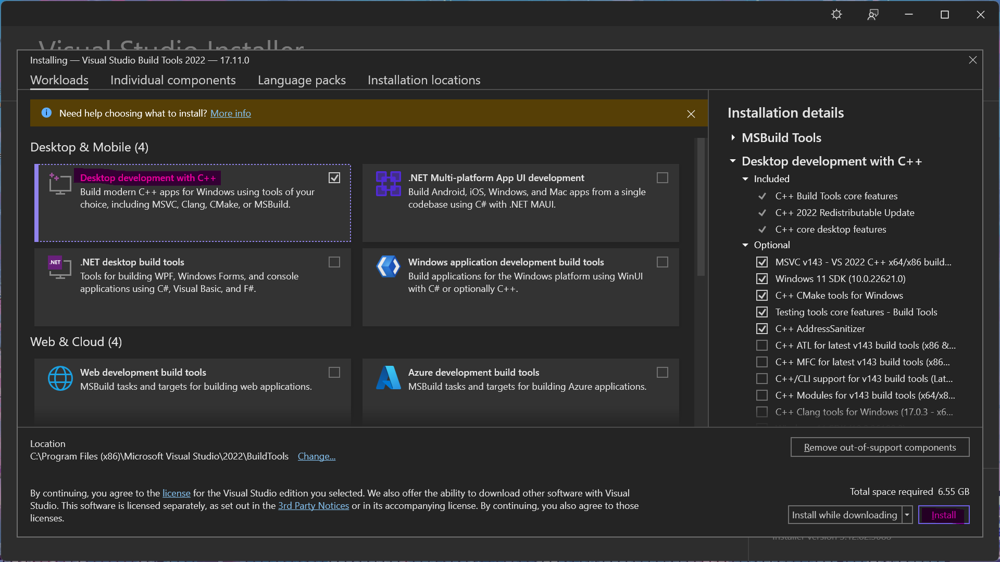

Install from source (Windows)
=========================================

.. contents::

This page describes the build and installation of PyBaMM from the source code, available on GitHub. Note that this is **not the recommended approach for most users** and should be reserved to people wanting to participate in the development of PyBaMM, or people who really need to use bleeding-edge feature(s) not yet available in the latest released version. If you do not fall in the two previous categories, you would be better off installing PyBaMM using pip or conda.

Lastly, familiarity with the Python ecosystem is recommended (pip, virtualenvs).
Here is a gentle introduction/refresher: `Python Virtual Environments: A Primer <https://realpython.com/python-virtual-environments-a-primer/>`_.

Prerequisites
---------------

To use PyBaMM, you must have Python 3.9, 3.10, 3.11, or 3.12 installed.

To install Python 3.X, download the installation files from `Python’s
website <https://www.python.org/downloads/windows/>`_. Make sure to
tick the box on ``Add Python 3.X to PATH``. For more detailed
instructions please see the `official Python on Windows
guide <https://docs.python.org/3.9/using/windows.html>`__.

(Optional) If you wish to build the documentation locally, you can install ``graphviz`` using the `Chocolatey <https://chocolatey.org/>`_ package manager,

.. code:: bash

	choco install graphviz --version=8.0.5

or follow the instructions on the `graphviz website <https://graphviz.org/download/>`_.

To install PyBaMM, you will need to install the following components:

C++ Compiler
~~~~~~~~~~~~

PyBaMM uses a recent version of Microsoft Visual C++ (MSVC), which you can get using `Build Tools for Visual Studio Code 2022 <https://visualstudio.microsoft.com/downloads/#build-tools-for-visual-studio-2022/>`_.

Note that you won't need Visual Studio 2022 entirely, just ``Desktop development with C++`` will suffice.

VCPKG
~~~~~

PyBaMM comes with a DAE solver based on the IDA solver provided by the SUNDIALS library.
To use this solver, you must make sure that you have the necessary SUNDIALS components
installed on your system.

VCPKG automatically installs them for you during the build process. To learn more, have a look at the `offical documentation by Microsoft <https://learn.microsoft.com/en-us/vcpkg/get_started/overview/>`_.

To install VCPKG, follow the steps below:

1. Open a Command Shell, and navigate to ``C:\``.
    * We are installing VCPKG in ``C:\vcpkg``
    * If you wish to install in a custom directory, make sure to change environment variable ``VCPKG_ROOT_DIR`` before installation as mentioned here in :ref:`installing-pybamm`.
2. Clone VCPKG's GitHub repository

   .. code:: bash

	  git clone https://github.com/microsoft/vcpkg.git

   * If you do not have Git installed, download and install it from the `official downloads page <https://git-scm.com/download/win>`_.

3. Navigate inside VCPKG directory and install it:

   .. code:: bash

	  cd vcpkg && bootstrap-vcpkg.bat

4. Add VCPKG directory to ``Path`` environment variable:
    * Copy the location ``C:\vcpkg``, or the location of your custom directory.
    * In the start menu, search for ``Edit the system environment variables`` and open it.
    * Under the ``Advanced`` tab, click on ``Environment Variables``
        .. image:: images-windows-source/pic2-env-var-open.png
			:scale: 70%

    * Select ``Path`` from ``user variables`` if you want to set VCPKG just for you, or use ``Path`` from ``system variables`` to set VCPKG for all the users using your system.
    	.. image:: images-windows-source/pic3-show-path.png
		    :scale: 50%

    * Select ``Path`` and click ``Edit``. select new. Paste the path to vcpasdfkg. then confirm your options by click okay.
    	.. image:: images-windows-source/pic4-save-env-var.png
		  :height: 900px
		  :width: 900px
		  :scale: 70%

5. Close and reopen Command Prompt and type ``vcpkg`` to see an output of different options available for ``vcpkg``.

CMake
~~~~~

``CMake`` is required to install the SUNDIALS and other libraries required for the ``IDAKLU`` solver.
To install it, follow the link to the `official downloads page <https://cmake.org/download/>`_.

Download an installer based on your system's architecture, i.e. ``x32/x64``, and make sure to check ``Add CMake to the PATH environment variable`` during installation.

Python Packages
~~~~~~~~~~~~~~~

In addition to the packages above, you will also need `TOML Kit <https://tomlkit.readthedocs.io/en/latest/>`_, a ``toml`` table parser. This is necessary for installing build-time dependencies when installing in "editable mode" without build isolation.

To install ``tomlkit`` to your local user accout (ensure you are not within a virtual environment), use the following command:

.. code:: bash

	  python3.X -m pip install --user tomlkit

Finally, we recommend using `Nox <https://nox.thea.codes/en/stable/>`_.
You can install it to your local user account (make sure you are not within a virtual environment) with

.. code:: bash

	  python3.X -m pip install --user nox

Note that running ``nox`` will create new virtual environments for you to use, so you do not need to create one yourself.

After installing the above packages, you need to add the following location to your ``Path`` environment variable to be able to run ``nox`` in a terminal, like command prompt.
Follow the instructions given above for VCPKG to add it to the ``Path``.

.. code::

	C:\Users\<USERNAME>\AppData\Roaming\Python\Python312\Scripts

Make sure to replace ``<USERNAME>`` with your user name.

.. _installing-pybamm:

Installing PyBaMM
-----------------

Open a Command Prompt and navigate to the folder where you want to install PyBaMM,

1. Obtain the PyBaMM source code, clone the GitHub repository or download the source archive on the repository's homepage.

   .. code:: bash

		  git clone https://github.com/pybamm-team/PyBaMM.git

2. Set the following environment variables by pasting the commands to your Command Prompt.

   .. code-block:: bash

		  set PYBAMM_USE_VCPKG=ON
		  set VCPKG_ROOT_DIR=C:\vcpkg
		  set VCPKG_DEFAULT_TRIPLET=x64-windows-static-md
		  set VCPKG_FEATURE_FLAGS=manifests,registries
		  set CMAKE_GENERATOR="Visual Studio 17 2022"
		  set CMAKE_GENERATOR_PLATFORM=x64

3. To check if the environment variables are properly set, try executing ``set CMAKE_GENERATOR_PLATFORM`` command to get an output ``CMAKE_GENERATOR_PLATFORM=x64``.

.. note::

	The environment variables set through Command Prompt will expire as soon as the session, i.e. terminal, is closed. Hence, the ``IDAKLU`` solver would not compile with the build commands if you closed and reopened the terminal.

	To avoid this, you can set them permanently by adding them in either ``User Variables`` or ``System Variables``, if you want to set them for all users on the system. For more information, follow `this tutorial <https://phoenixnap.com/kb/windows-set-environment-variable#ftoc-heading-4>`_ on how to set environmental variables permanently.

You should now have everything ready to build and install PyBaMM successfully.

Using ``Nox`` (recommended)
~~~~~~~~~~~~~~~~~~~~~~~~~~~

In the same Command Prompt shell where you've set the environment variables, execute the following command inside the PyBaMM directory:

.. code:: text

	nox -s dev

.. note::
	It is recommended to use ``--verbose`` or ``-v`` to see outputs of all commands run.

This creates a virtual environment ``venv/`` inside the ``PyBaMM/`` directory.
It comes ready with PyBaMM and some useful development tools like `pre-commit <https://pre-commit.com/>`_ and `ruff <https://beta.ruff.rs/docs/>`_.

You can now activate the environment with

.. code:: text

	venv\Scripts\activate.bat

and run the tests to check your installation.

Manual install
~~~~~~~~~~~~~~

We recommend to install PyBaMM within a virtual environment, in order not to alter any distribution python files.

In the same Command Prompt shell where you've set the environment variables, install ``virtualenv`` by exexuting the following command:

.. code:: bash

   python -m pip install virtualenv

Create a virtual environment ``venv`` within the PyBaMM directory:

.. code:: bash

   python -m virtualenv venv

You can then “activate” the environment using:

.. code:: text

   venv\Scripts\activate.bat

Now all the calls to pip described below will install PyBaMM and its
dependencies into the environment ``venv``. When you are ready to exit
the environment and go back to your original system, just type:

.. code:: bash

   deactivate

From the ``PyBaMM/`` directory inside the virtual environment, you can install PyBaMM using

.. code:: bash

	  pip install .

If you want to install PyBaMM in an "editable mode", use the following command:

.. code:: bash

	  pip install -e .

If you intend to contribute to the development of PyBaMM, it is convenient to
install in "editable mode", along with all the optional dependencies and useful
tools for development and documentation.

Due to the ``--no-build-isolation`` flag in the "editable mode" command, you first need to install the build-time dependencies inside the virtual environment:

.. code:: bash

	pip install scikit-build-core==0.10.3 pybind11

You can now install PyBaMM in "editable mode" for development using the following commands:

.. code:: bash

	  pip install --no-build-isolation --config-settings=editable.rebuild=true -ve .[all,dev,docs]

Before you start contributing to PyBaMM, please read the `contributing
guidelines <https://github.com/pybamm-team/PyBaMM/blob/develop/CONTRIBUTING.md>`__.

Running the tests
-----------------

Using Nox (recommended)
~~~~~~~~~~~~~~~~~~~~~~~

You can use ``Nox`` to run the unit tests and example notebooks in isolated virtual environments.

Make sure to install ``graphviz`` using the `Chocolatey <https://chocolatey.org/>`_ package manager or, by following the instructions on the `graphviz website <https://graphviz.org/download/>`_ to pass all the tests. Otherwise, you can safely ignore the failed tests needing ``graphviz``.

The default command

.. code:: bash

	nox

will run pre-commit and run the unit tests.
This can take several minutes.

To just run the unit tests, use

.. code:: bash

	nox -s unit

Similarly, to run the integration tests, use

.. code:: bash

	nox -s integration

Finally, to run the unit and the integration suites sequentially, use

.. code:: bash

	nox -s tests

Using the test runner
~~~~~~~~~~~~~~~~~~~~~~

You can run unit tests for PyBaMM inside the virtual environment using

.. code:: bash

	  # in the PyBaMM/ directory
	  python run-tests.py --unit

The above starts a sub-process using the current python interpreter (i.e. using your current
Python environment) and run the unit tests. This can take a few minutes.

You can also use the test runner to run the doctests:

.. code:: bash

	  python run-tests.py --doctest

There is more to the PyBaMM test runner. To see a list of all options, type

.. code:: bash

	  python run-tests.py --help

How to build the PyBaMM documentation
-------------------------------------

The documentation is built using

.. code:: bash

	  nox -s docs

This will build the documentation and serve it locally (thanks to `sphinx-autobuild <https://github.com/GaretJax/sphinx-autobuild>`_) for preview.
The preview will be updated automatically following changes.

Doctests, examples, and coverage
--------------------------------

``Nox`` can also be used to run doctests, run examples, and generate a coverage report using:

- ``nox -s examples``: Run the Jupyter notebooks in ``docs/source/examples/notebooks/``.
- ``nox -s examples -- <path-to-notebook-1.ipynb> <path-to_notebook-2.ipynb>``: Run specific Jupyter notebooks.
- ``nox -s scripts``: Run the example scripts in ``examples/scripts/``.
- ``nox -s doctests``: Run doctests.
- ``nox -s coverage``: Measure current test coverage and generate a coverage report.
- ``nox -s quick``: Run integration tests, unit tests, and doctests sequentially.

Extra tips while using ``Nox``
------------------------------

Here are some additional useful commands you can run with ``Nox``:

- ``--verbose or -v``: Enables verbose mode, providing more detailed output during the execution of Nox sessions.
- ``--list or -l``: Lists all available Nox sessions and their descriptions.
- ``--stop-on-first-error``: Stops the execution of Nox sessions immediately after the first error or failure occurs.
- ``--envdir <path>``: Specifies the directory where Nox creates and manages the virtual environments used by the sessions. In this case, the directory is set to ``<path>``.
- ``--install-only``: Skips the test execution and only performs the installation step defined in the Nox sessions.
- ``--nocolor``: Disables the color output in the console during the execution of Nox sessions.
- ``--report output.json``: Generates a JSON report of the Nox session execution and saves it to the specified file, in this case, "output.json".
- ``nox -s docs --non-interactive``: Builds the documentation without serving it locally (using ``sphinx-build`` instead of ``sphinx-autobuild``).

Troubleshooting
---------------

**Problem:** I ran a ``nox``/python build command and encountered ``Configuring incomplete, errors occurred!`` error.

**Solution:** This can occur when the environment variables are improperly set in the terminal.

1. Make sure you've set environment variables before running any ``nox``/python build command.
2. Try running the build command again in the same terminal.

**Problem:** I have made edits to source files in PyBaMM, but these are
not being used when I run my Python script.

**Solution:** Make sure you have installed PyBaMM using the ``-e`` flag, like so:

.. code:: bash

	pip install -ve .

If you want to install to contribute to PyBaMM, use this command:

.. code:: bash

	pip install --no-build-isolation --config-settings=editable.rebuild=true -ve .[all,dev,docs]

This sets the installed location of the
source files to your current directory.
